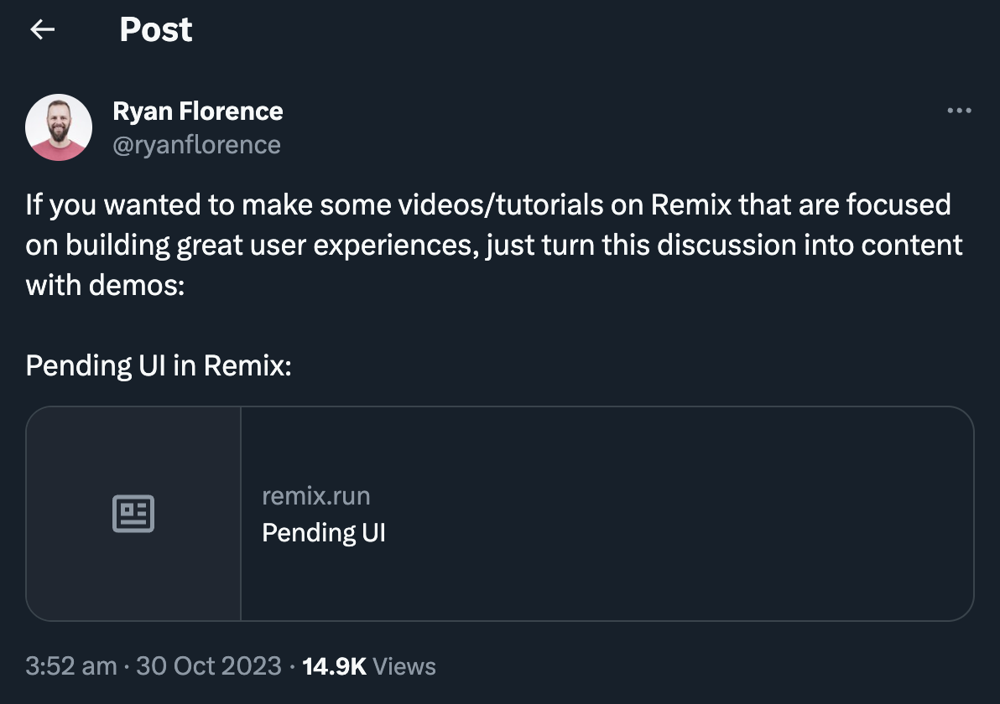

# Pending UI States

This blog post was inspired by [a tweet from Ryan Florence](https://twitter.com/ryanflorence/status/1718717433664737686):



The Remix docs has [a great discussion post](https://remix.run/docs/en/main/discussion/pending-ui) about various types of pending UI states, and serves as the main reference of this blog for the examples I'll be demonstrating later.

> **Note**
>
> Want to follow along with the code examples I'll be showing? Just head over to the `starter/` folder and follow the setup instructions to run a minimal example app without the Pending UI examples. If you want to see the finished version, just head over to the `demo/` folder instead.

## Examples of Pending UI

If you regularly browse the internet, you've probably encountered these pending UI states too many times to count. They're especially noticeable on slower connection speeds, where you're usually left staring at the screen for several seconds watching that spinner go round and round.

While it can be frustrating as a user to see these pending UI states, they are often necessary to maintain a proper flow in your user experience. A great user experience can be characterised by a thoughtful use of these pending UI states to provide proper visual cues during network-intensive actions.

The Remix docs categorises pending UI states to three different types. Let's see some examples for each of them and see where they might be used in a web application.

### Busy Indicators (Spinners)

The simplest (and probably the most common) form of busy indicator is a spinner that shows up when the page is still loading:

```tsx
const navigation = useNavigation();

if (navigation.state === "loading") {
  return (
    <div className="flex h-screen w-screen items-center justify-center">
      <Spinner />
    </div>
  );
}
```

You can also use spinners on the links themselves to indicate that the navigation is in progress. This can be useful on things like main navigation links.

> **Note**
>
> Remix has a `<NavLink />` component that provides helpful props for styling active and pending states. For example, you can use the `isPending` state to render a spinner while you're navigating to another page:
>
> ```tsx
> // app/routes/_index.tsx
> <NavLink to="messages/new" className="...">
>   {({ isPending }) => (
>     <>
>       {isPending ? <Spinner /> : null}
>       New Message
>     </>
>   )}
> </NavLink>
> ```
>
> &nbsp;

Busy indicators are especially useful when working with form submissions. If you can keep track of the progress of the form submission, you can use it to display a busy indicator and/or disable the form inputs/submit buttons while the form submission is in progress.

Let's see an example using the example app. In a Remix app, you can check the `navigation.formAction` value (or `fetcher.state` if you're using `useFetcher()`) to determine whether the form is submitting:

```tsx
// app/routes/messages.new.tsx
const isSubmitting = navigation.formAction === "/messages/new";
```

You can then use the `isSubmitting` variable to display the `<Spinner />` and disable the form inputs while the submission is in progress:

```diff
// app/routes/messages.new.tsx
<Form method="post">
-	<fieldset className="...">
+	<fieldset className="..." disabled={isSubmitting}>
		/* ... */
		<button className="...">
+			{isSubmitting ? <Spinner /> : null}
			Submit
		</button>
	</fieldset>
</Form>
```

### Skeleton Fallbacks

In Remix, you can `defer` some data to be sent to the client so that the client can quickly load the page with smaller bits of important data while the `defer`-red data loads in the background.

Inthe example app, we can use `defer` to `await` the message content and just let the replies load in the background. While we're at it, let's also increase the delay on the `setTimeout` for dramatic effect:

```diff
export async function loader({ params }: LoaderFunctionArgs) {
	const message = await db.message.findUnique({
		where: {
			id: params.id,
		},
		select: { author: true, content: true },
	});
	const repliesPromise = new Promise((resolve, reject) => {
-		setTimeout(resolve, 0);
+		setTimeout(resolve, 3000);
	}).then(() =>
		db.message.findMany({
			where: { parent_id: params.id },
			select: { id: true, author: true, content: true },
			orderBy: { createdAt: "desc" },
		}),
	);

	return defer({
		message,
-		replies: await repliesPromise,
+		replies: repliesPromise,
	});
}
```

We can use React's `<Suspense />` along with Remix's `<Await />` to display a skeleton fallback while waiting and then display the `defer`-red data when it finally finishes loading:

```tsx
// app/routes/messages.$id.tsx
<Suspense
  fallback={
    <div className="flex flex-col gap-2 rounded-md border border-dashed border-black p-4">
      <div className="h-4 w-36 animate-pulse bg-slate-500" />
      <div className="h-4 w-64 animate-pulse bg-slate-500" />
    </div>
  }
>
  <Await resolve={replies}>
    {(replies) => {
      if (replies.length === 0) {
        return (
          <div className="rounded-md border border-dashed border-black p-8 text-center">
            No replies yet. Be the first to reply to this post now!
          </div>
        );
      }

      return (
        <>
          {replies.map((reply) => (
            <article
              key={reply.id}
              className="flex flex-col rounded-md border border-black p-4"
            >
              <p>
                <span className="font-bold">{reply.author}</span> replied:
              </p>
              <p>{reply.content}</p>
            </article>
          ))}
        </>
      );
    }}
  </Await>
</Suspense>
```

### Optimistic UI

Optimistic UIs can be a great way to improve user experience for processes with fairly predictable results, such as liking/bookmarking a post in social media. Since network requests to tell the server to update cetrain values can take time, we can take advantage of the predictable nature of our request to immediately display the expected result on the client side, without waiting for the server response to reflect the updated values.

In the example app, let's use the Optimistic UI pattern to immediately display the reply to a message without waiting for the delayed server response.

In Remix, we can use `fetcher.formData` to get the values the user just submitted:

```tsx
// app/routes/messages.$id.tsx
let pendingReply: { author: string; content: string } | undefined;
if (fetcher.formData) {
  const author = fetcher.formData.get("author") || "Anonymous";
  const content = fetcher.formData.get("content");

  //? You can use the same validation logic as you used in the `action`
  if (typeof author === "string" && typeof content === "string") {
    pendingReply = {
      author,
      content,
    };
  }
}
```

Now that we have a `pendingReply` with the values we got from the `formData`, we can simply append it to the other replies in the list (or replace the placeholder for an empty list). In this example, we'll also style the `pendingReply` a bit differently to distinguish it from the other existing replies:

```diff
// app/routes/messages.$id.tsx
<div className="flex flex-col gap-4">
+	{pendingReply ? (
+		<article className="flex flex-col rounded-md border border-dashed border-slate-500 bg-slate-100 p-4 text-slate-500">
+			<p>
+				<span className="font-bold">{pendingReply.author}</span>{" "}
+				replied:
+			</p>
+			<p>{pendingReply.content}</p>
+		</article>
+	) : null}
	<Suspense
		fallback={/* ... */}
	>
		<Await resolve={replies}>
			{(replies) => {
-				if (replies.length === 0) {
+				if (!pendingReply && replies.length === 0) {
					return (
						<div className="rounded-md border border-dashed border-black p-8 text-center">
							No replies yet. Be the first to reply to this post now!
						</div>
					);
				}
				/* ... */
			}}
		</Await>
		/* ... */
	</Suspense>
</div>
```

We can also use the `pendingReply` to display the busy indicator while we wait for the server response:

```diff
// app/routes/messages.$id.tsx
<fetcher.Form method="post" ref={$form}>
-	<fieldset className="flex flex-col gap-2">
+	<fieldset className="flex flex-col gap-2" disabled={!!pendingReply}>
		{/* ... */}
		<button className="...">
+			{pendingReply ? <Spinner /> : null}
			Post Reply
		</button>
	</fieldset>
</fetcher.Form>
```

## When to Use Each Type of Pending UI

As the Remix docs states, a great user experience makes use of these different types of pending UI states to provide proper visual cues for ongoing network requests while making the overall experience less frustrating as possible.

### When should you use Busy Indicators?

Being the most common type of pending UI state to be seen in many web applications, busy indicators are also the most familiar type of pending UI that users can identify. The Remix docs suggests using busy indicators when there's a lot of uncertainty involved in the associated network request, such as triggering side effects with critical processes or navigating to a new page or section.

In our example, we used busy indicators mainly to indicate pending form submissions. Since we also disable form inputs and submit buttons while the form submission is in progress, the busy indicator helpfully indicates to the user to wait until the submission completes before attempting another submission.

### When should you use Skeleton Fallbacks?

Another commonly used form of pending UI, skeleton fallbacks are also easily recognizable to the user. Since skeleton fallbacks provide an outline to how the pending content will look once it resolves, they can be really useful to help make your web application have a more "app-like" feel. The Remix docs suggests using skeleton fallbacks when you can render a small amount of important content (via `defer`) and let the less important, but more network-intensive requests load in the background.

In our example, we used a skeleton fallback to view the main message content while we wait for the (artificially delayed) replies load into the page. This way, the user can view the main content of the message and expect the replies to get loaded in later.

### When should you use Optimistic UI?

Optimistic UIs are less obvious to spot, mainly because they are designed to make a smoother user experience for predictable network requests. The Remix docs suggests using Optimistic UI when you can reasonably expect the result of your network request (typically with actions that don't lead to a change in URL) so you can immediately show the expected result to the user.

In our example, we used Optimistic UI when posting a reply to a message, letting us immediately see the reply we just wrote get appended to the top of the replies list while the (still artificially delayed) request for the updated replies loads in the background. We can style the optimistically displayed reply however we want - in this case we styled it a bit differently to that we can distinguish when it's still in a pending state until it turns back into the usual styles when the updated replies finish loading.

## Conclusion

Let's close this blog post with a direct quote from the Remix docs:

> _"Creating network-aware UI via busy indicators, optimistic UI, and skeleton fallbacks significantly improves the user experience by showing visual cues during actions that require network interaction. Getting good at this is the best way to build applications your users trust."_

Pending UI states can be frustrating to users especially on slow network connections. We can lessen this pain, and maybe even improve the overall experience by giving more thought to where we use which type of pending UI to provide helpful visual cues and maintain a proper flow in the user's experience using your applications.
